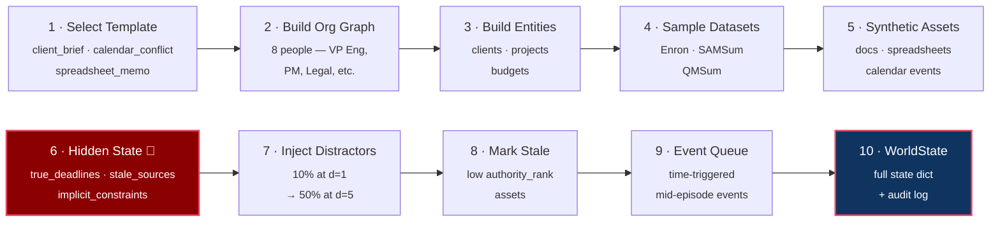
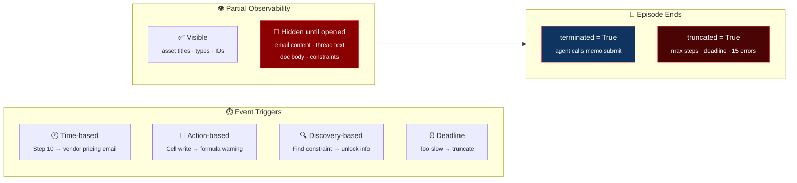
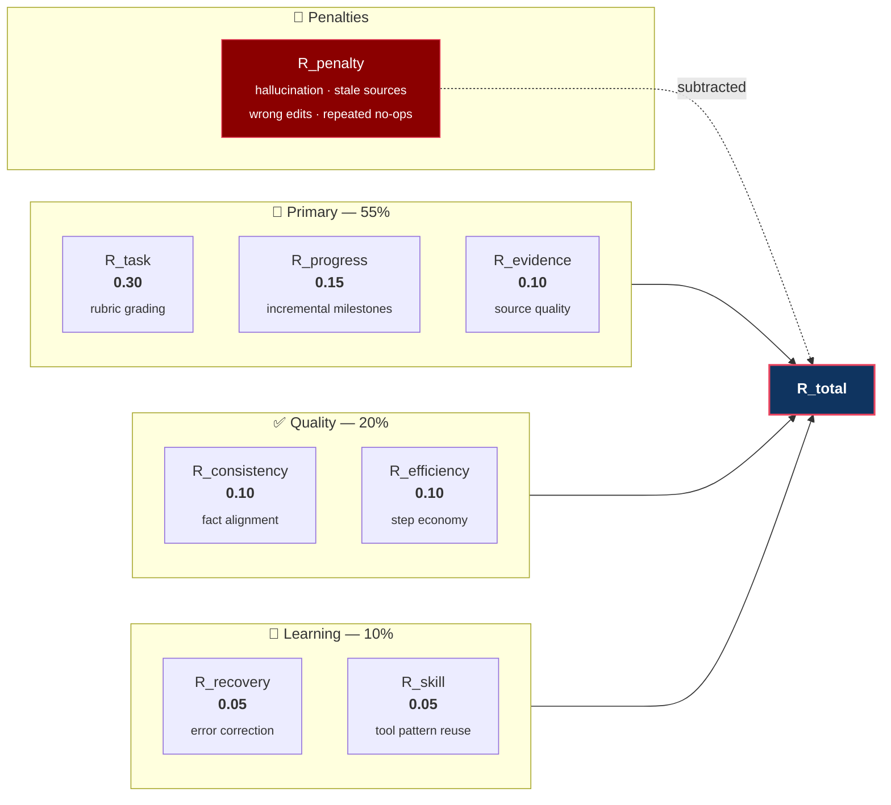
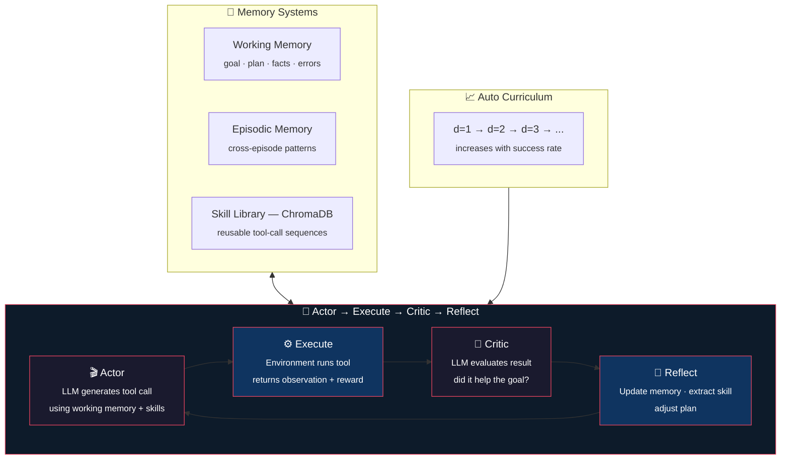

## How We Built the Voyager Environment — Presentation Walkthrough

### Step 1: World Foundation — Schemas & Data Model

We started by defining **what a workplace world looks like** as structured data. We created JSON schemas for every object in the simulation:

- **`schemas/world_state.json`** — the master state object for an episode
- **`schemas/asset.json`** — emails, chats, documents, spreadsheets, calendar events, meetings
- **`schemas/entity.json`** — people, clients, projects, documents as named entities
- **`schemas/action.json` / `observation.json`** — typed IO for OpenEnv compatibility

Every asset has metadata fields: `visibility_scope`, `authority_rank`, `freshness_score`, `access_control`, `derived_from`. These power the hidden-state logic and reward grading later.

---

### Step 2: Dataset Normalization Pipeline

We built normalizers that convert **real NLP/workplace datasets** into our unified asset format. Each normalizer reads a different source and outputs the same standardized structure:

| Dataset | Type | Normalizer | What it becomes |
|---------|------|-----------|----------------|
| **Enron emails** | Real corporate email corpus | `normalize_email.py` | `EmailThread` assets with messages, participants, subjects, speech acts |
| **SAMSum** | 16K chat dialogues with summaries | `normalize_chat.py` | `ChatThread` assets (Slack-like conversations) |
| **DialogSum** | 13K dialogues across domains | `normalize_chat.py` | Fallback chat pool when SAMSum unavailable |
| **QMSum** | Meeting transcripts with queries | `normalize_meeting.py` | `MeetingArtifact` assets (meeting notes, decisions, action items) |
| **Synthetic** | Generated at episode time | `normalize_doc.py`, `normalize_spreadsheet.py`, `normalize_calendar.py` | Documents, spreadsheets with formulas, calendar events |

The key design: **real datasets are the "furniture" of our world**. An email from Enron becomes a project discussion thread. A SAMSum dialogue becomes a Slack channel conversation. A QMSum transcript becomes meeting notes. This gives the world realistic language patterns that a purely synthetic environment wouldn't have.

Each normalizer attaches provenance metadata: `source_dataset`, `original_split`, `license_tag`, `transformation_history` — so we can track where every piece of content came from.

---

### Step 3: Episode Generation — Assembling a World

The `EpisodeGenerator` is the keystone. When you call `reset()`, it orchestrates this 10-step pipeline:



Each step in detail:

1. **Select a project template** — 3 task families (`client_brief`, `calendar_conflict`, `spreadsheet_memo`), each defining required asset counts, subgoals, constraint types, and an org chart
2. **Build the org graph** — 8 people with roles (VP Engineering, PM, Legal Counsel, etc.), team membership, and reporting chains
3. **Build entities** — clients, projects, budgets as named objects with aliases
4. **Sample assets from dataset pools** — pull 5-12 emails from Enron, 2-6 chats from SAMSum, 1-2 meetings from QMSum
5. **Generate synthetic assets** — documents, spreadsheets with formulas and protected ranges, calendar events
6. **Generate hidden state** — the secret sauce: `true_deadlines`, `authoritative_sources`, `stale_sources`, `implicit_constraints`, `dependency_graph`, `blocking_issues`, `critical_facts`, `rubric_targets`
7. **Inject distractors** — irrelevant emails, old threads, outdated docs. Density scales with difficulty (10% at d=1, 50% at d=5)
8. **Mark stale sources** — some assets are intentionally outdated with low authority_rank. Agent must identify and avoid them
9. **Build event queue** — delayed events that fire mid-episode (at d≥3: vendor pricing; at d≥4: formula warnings)
10. **Assemble the full WorldState dict** — everything packaged into one object with an audit log

The **difficulty scaling** is explicit per template:

```
d=1: 1 distractor, 1 constraint, 0 stale sources, 2 channels
d=3: 3 distractors, 3 constraints, 1 stale source, 4 channels
d=5: 6 distractors, 5 constraints, 3 stale sources, 6 channels
```

---

### Step 4: Tool-Centric API — 31 Tools Across 8 Categories

The agent interacts with the world **exclusively through tools**. We built 31 tool handlers organized into 7 modules:

| Category | Tools | What they do |
|----------|-------|-------------|
| **Mail** (6) | `mail.list_inbox`, `mail.search`, `mail.open_thread`, `mail.open_message`, `mail.draft_reply`, `mail.send_reply` | Navigate email, read threads, respond |
| **Chat** (5) | `chat.list_channels`, `chat.search`, `chat.open_thread`, `chat.open_channel`, `chat.post_message` | Browse Slack-like channels |
| **Drive** (4) | `drive.list_files`, `drive.search`, `drive.open_file`, `drive.compare_versions` | Find and read documents |
| **Sheet** (5) | `sheet.open`, `sheet.read_range`, `sheet.write_cell`, `sheet.write_range`, `sheet.get_formula` | Read/edit spreadsheets |
| **Calendar** (4) | `calendar.view`, `calendar.check_conflicts`, `calendar.propose_time`, `calendar.create_hold` | Schedule management |
| **Notes** (4) | `notes.write`, `memo.create`, `memo.submit`, `task.mark_done` | Create deliverables |
| **Meta** (3) | `search.global`, `entity.resolve`, `workspace.status` | Cross-system search, entity lookup |

Every tool returns a standardized result: `{status, result, observations, state_delta, cost_metadata}`. The `state_delta` is how tools mutate world state — opening a thread marks it as "accessed", writing a cell updates spreadsheet state, submitting a memo triggers task evaluation.

The **ActionRouter** dispatches tool calls, applies state mutations (supporting dot-notation paths and `.append` operations), and logs every action to the `audit_log`.

---

### Step 5: State Dynamics — Events, Time, Partial Observability

The **EventQueue** advances time by 5 minutes per step and fires events based on conditions:



- **Time-based**: "At step 10, vendor sends updated pricing email"
- **Action-based**: "When agent writes to a cell, warn about formula dependencies"
- **Discovery-based**: "When agent finds the hidden constraint, unlock new information"
- **Deadline expiration**: If the agent takes too long, episode truncates

**Partial observability** is the core challenge: the agent sees asset titles, types, and IDs — but **not** the content of emails, threads, or documents until it explicitly opens them. Hidden constraints are never directly stated. The agent must cross-reference multiple sources to discover the truth.

**Termination conditions**:
- `terminated=True`: Agent calls `memo.submit` (task completion attempt)
- `truncated=True`: Max steps reached, deadline exceeded, or 15 consecutive errors

---

### Step 6: Multi-Component Reward System (8 Signals)

This is where the environment becomes a proper RL training ground. We compute rewards from 8 independent modules:

```
R_total = 0.30·R_task + 0.15·R_progress + 0.10·R_evidence + 0.10·R_consistency
        + 0.10·R_efficiency + 0.05·R_recovery + 0.05·R_skill − R_penalty
```



| Signal | Module | What it measures |
|--------|--------|-----------------|
| **R_task** | `grader.py` | Rubric-based: does the submitted memo have the right sections, citations, numbers? Anti-shortcut checks prevent plausible-but-wrong submissions |
| **R_progress** | `progress.py` | Incremental: +0.02 for opening relevant files, +0.05 for finding authoritative sources, +0.07 for discovering hidden constraints |
| **R_evidence** | `evidence.py` | Source quality: did the agent cite authoritative vs. stale sources? |
| **R_consistency** | `consistency.py` | Fact alignment: does the memo match the spreadsheet? Are numbers consistent? |
| **R_efficiency** | `efficiency.py` | Step economy: penalizes duplicate searches, rewards focused exploration |
| **R_recovery** | `recovery.py` | Error correction: detects when agent fixes a previously failed subgoal |
| **R_skill** | `skill.py` | Tool pattern mastery: rewards reuse of known-good tool sequences |
| **R_penalty** | `penalties.py` | Hallucination, wrong cell edits, stale source usage, repeated no-ops |

Weights are tunable per task family. `client_brief` weights evidence higher; `calendar_conflict` weights consistency higher.

---

### Step 7: Making It an RL Environment

The whole thing is wrapped in a **Gymnasium-compatible API**:

```python
ws = WorldState(max_steps=50)
obs = ws.reset(seed=42, project_type="client_brief", difficulty_level=2)
# obs → {task_goal, assets, entities, available_tools, ...}

obs, reward, terminated, truncated, info = ws.step({
    "tool_name": "mail.list_inbox",
    "arguments": {}
})
# reward is the step-level shaped reward
# info contains tool_result, triggered_events, episode_reward, etc.
```

This is then wrapped for **OpenEnv** via `WorkSimEnvironment(Environment)` — the standard `reset()/step()` interface that OpenEnv expects. The FastAPI server exposes it over HTTP (`POST /reset`, `POST /step`) and WebSocket (`/ws` for stateful sessions).

**Key RL properties**:
- **Deterministic with seed**: Same seed → same episode every time
- **Sparse + shaped rewards**: Environment reward is sparse (only on submit), shaped reward is dense (every step)
- **Partial observability**: Agent must actively explore to build knowledge
- **Long horizon**: 25-100 steps to complete a task
- **Compositional action space**: 31 tools × variable arguments
- **State mutation**: Actions change the world (writing cells, sending emails, creating memos)

---

### Step 8: Voyager-lite Architecture On Top

The environment is the foundation. On top, we built the **Voyager-lite agent** with:



- **Skill Library** (ChromaDB) — stores reusable tool-call patterns, retrieves by semantic similarity
- **Working Memory** — in-episode scratchpad (goal, plan, facts, errors)
- **Episodic Memory** — cross-episode learning (what strategies worked, what failed)
- **Auto Curriculum** — starts at d=1, increases when success rate improves
- **Actor→Execute→Critic→Reflect loop** — LLM generates action, environment executes, LLM critiques, memory updates

Then we **post-trained** a Qwen2.5-1.5B model using Expert Iteration (rejection sampling + SFT) with the Voyager agent generating high-quality training data through the skill library and memory systems.

---

**The key insight**: the environment is **genuinely hard** because information is scattered, some sources are stale/wrong, constraints are hidden, and the agent must synthesize across multiple tools and asset types to produce a correct deliverable. This mirrors real workplace cognitive load — and that's what makes it valuable for RL training.