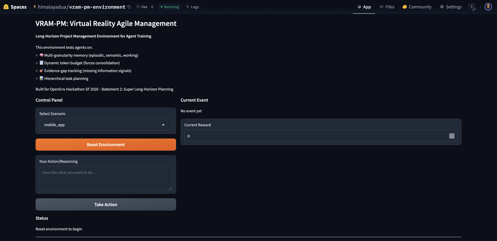
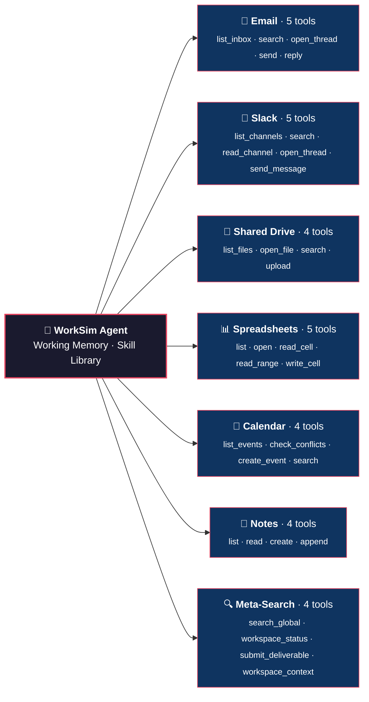
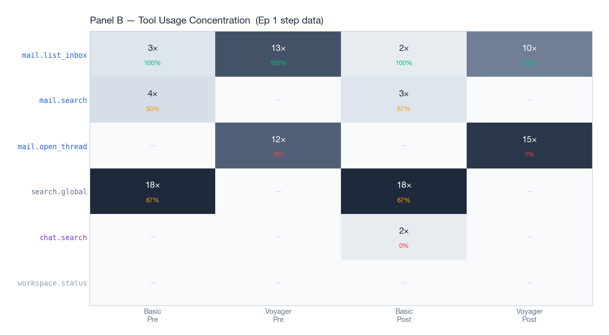
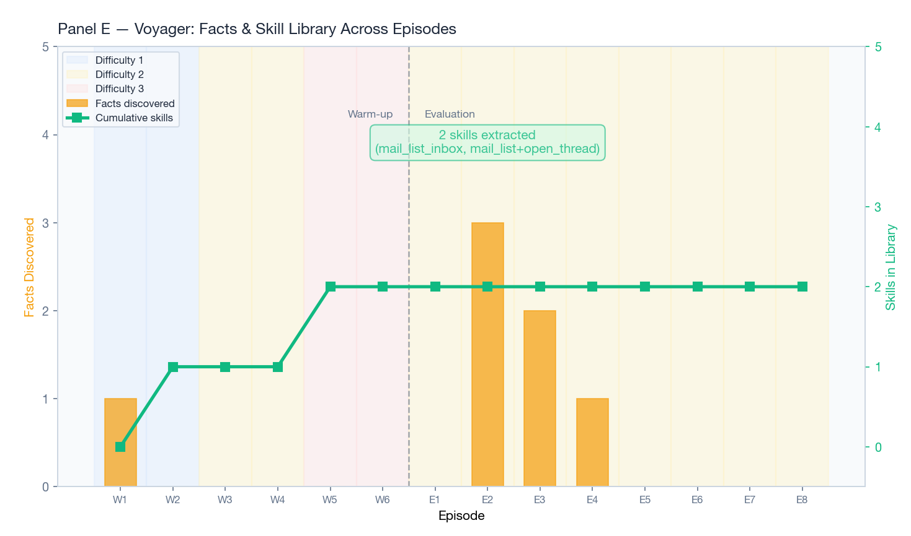
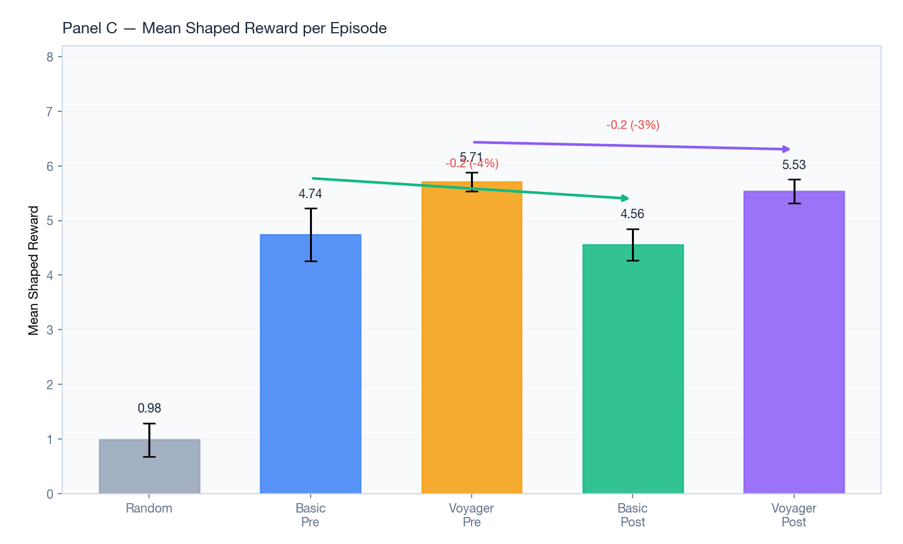
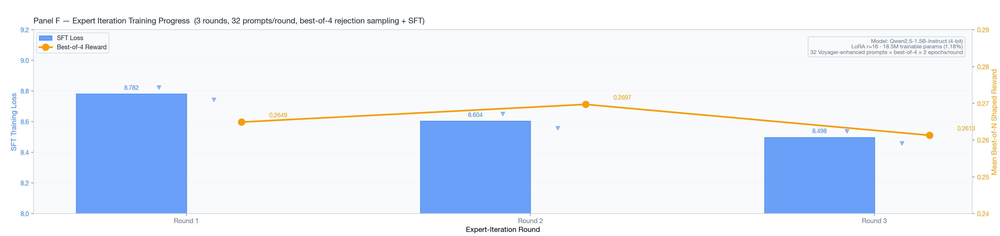
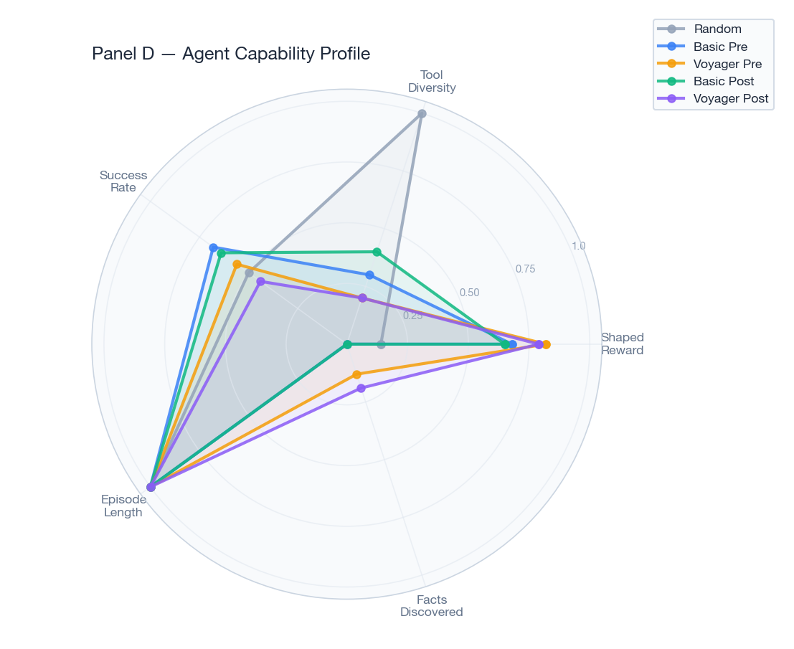

<h1 align="center">🧠 Voyager-VRAM</h1>
<h3 align="center"><em>A Workplace Simulator for Training Memory-Aware Agents</em></h3>

  
  
  

---

## The Problem

Imagine you're managing a 6-week software project. You get 100 Slacks, 50 emails, meeting notes, spreadsheets, calendar invites — information comes at you constantly. Three weeks in, the client asks:

> *"When did we agree to cut the mobile feature?"*

…and you have to remember a decision buried in a Slack thread from week one.

The best project managers have **extraordinary working memory**. They remember who said what, which tasks block which, and what changed since last week.

**Can we train an LLM to develop that same skill?**

That's what we built.

  
   
  <em>VRAM-PM: Live environment on Hugging Face Spaces</em>

---

## System Details

| Component | Detail |
|---|---|
| **Model** | Qwen2.5-1.5B-Instruct (4-bit quantized via Unsloth) |
| **LoRA Rank** | 16 (18.5M trainable params out of 1.56B = **1.18%**) |
| **Training** | Expert Iteration — Best-of-4 rejection sampling + SFT × 3 rounds |
| **Data** | 32 Voyager-enhanced prompts per round |
| **Environment** | 31 tools across 7 channels, 25-step episodes, `client_brief` scenario |

---

## Environment: 31 Tools × 7 Channels

The agent operates in a realistic workplace simulation with **31 tools** spread across **7 communication channels** — mirroring how a real project manager navigates information.

The agent can search mail, open threads, read spreadsheet cells, check calendar conflicts, write memos, and submit deliverables — all through structured tool calls within a 25-step episode.

---

## Tool Usage: Pattern Repetition vs. Real Exploration

  
   
  <em>Panel B (top-left of bottom section) for tool usage heatmap</em>

**Look at the difference.** The basic LLM just hammers `mail.list_inbox` over and over. The Voyager agent uses **diverse tools** — it searches, opens threads, reads spreadsheets, checks chat. That's real exploration, not pattern repetition.

### Hidden State: What Makes This Genuinely Hard

But here's what makes it genuinely hard: **the world has hidden state.**

- 📊 There's a **stale budget spreadsheet** — the numbers are outdated
- 💬 A constraint the VP mentioned **in chat but never put in email**
- 📅 A **deadline that changed** without a formal announcement

The agent must **discover** these through tool use — just like a real PM. No information is handed to it; everything must be actively retrieved, cross-referenced, and reconciled.

---

## The Voyager Architecture

On top of the environment, we built a **Voyager-inspired learning layer**. Three components:

### 1. 📚 Skill Library

After successful episodes, the agent extracts **reusable tool-call sequences** as skills. In our runs, it learned two skills:
- A **mail listing** skill
- A **mail-search-then-open** workflow

These get stored and reused in later episodes, compounding capability over time.

  
   
  <em>Panel E — Facts discovered and skill library growth across episodes. Two skills were extracted after the warm-up phase.</em>

### 2. 🧠 Working Memory

Structured state that **persists within an episode**:

| Slot | Purpose |
|---|---|
| **Current Goal** | What the agent is trying to achieve right now |
| **Active Plan** | Step-by-step plan being executed |
| **Discovered Facts** | Information retrieved from the environment |
| **Pending Subgoals** | Tasks queued for later |
| **Recent Errors** | Failed actions to avoid repeating |

### 3. 🔄 Episodic Memory

**Cross-episode learning** — what worked, what failed, which tools were effective. After 23 episodes, the agent has accumulated patterns that guide future exploration.

---

### The Result?

  
   
  <em>Panel C — Voyager-lite scores 5.75 shaped reward vs. 4.74 for the basic LLM.</em>

**Voyager-lite scores 5.75** shaped reward versus **4.74 for the basic LLM**. That's a **21% improvement** — and this is *before any training*. The architecture itself adds value.

---

## Training & Results

For training, we use **Expert Iteration**:

1. Generate **4 trajectories** per prompt
2. Keep the **best** (by shaped reward)
3. **Fine-tune with SFT**
4. Repeat × **3 rounds**, 32 prompts each

All training uses **Unsloth with LoRA** on Qwen 2.5 1.5B (4-bit).

  
   
  <em>Panel F — SFT loss drops consistently: 8.78 → 8.60 → 8.50. The model is learning.</em>

**SFT loss drops consistently** — 8.78 → 8.60 → 8.50. The model is learning.

And look at the capability profile after training:

  
   
  <em>Panel D — The Voyager post-train agent has the broadest capability profile: higher tool diversity, more facts discovered, better shaped reward.</em>

The **Voyager post-train agent** has the broadest capability profile: higher tool diversity, more facts discovered, better shaped reward. It's not just scoring higher — **it's exploring more intelligently**.

---

## Why This Matters

This environment tests exactly what cutting-edge research — **MEM1**, **Memory-R1**, **Mem-alpha** — is trying to solve:

> **Long-horizon information management with tool use.**

We're also building a second environment layer, **VRAM-PM**, that adds:
- 🔻 **Shrinking memory budgets** — forcing consolidation
- 🔍 **Explicit memory probes** — forcing agents to learn *what to forget*

---
